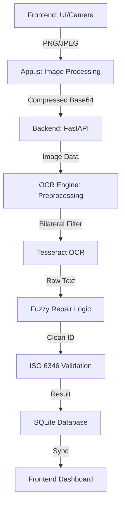

# System Architecture

This document outlines the technical design of the Ayahay SmartScan pipeline.

## The Data Flow

## OCR Intelligence

### 1. Robust Preprocessing
To handle real-world mobile camera photos, we apply:
- **Grayscale Conversion**: Reduces noise from color artifacts.
- **Bilateral Filtering**: Unlike Gaussian blur, it preserves sharp character edges while smoothing out the noise from paper texture.
- **Adaptive Thresholding**: Dynamically adjusts to shadows and uneven lighting conditions across the document.

### 2. Fuzzy Repair System
Mobile OCR often misreads specific characters. Our engine contains a specialized "Repair" layer that runs before validation:
- **Prefix Repair**: Swaps numbers back to letters (e.g., 0 -> O, 1 -> I).
- **Suffix Repair**: Swaps letters back to numbers (e.g., S -> 5, O -> 0).
- **Checksum Brute-forcing**: If a candidate ID fails initial validation, we attempt localized character swaps to recover the intended ID.

## Frontend Strategy
- **Canvas-based Compression**: Images are scaled to a MAX_WIDTH of 2500px on the client-side to save bandwidth while maintaining OCR legibility.
- **Transparency Safeguard**: The engine fills the canvas with #FFFFFF (Solid White) before drawing, preventing transparent PNG artifacts from becoming black during JPEG conversion.

## Storage
- **SQLite**: A lightweight database stores every scan, including the timestamp, filename, raw OCR text, and the final validated ID.
- **FastAPI**: Provides a RESTful interface for the frontend to fetch scan history and submit new tasks.
